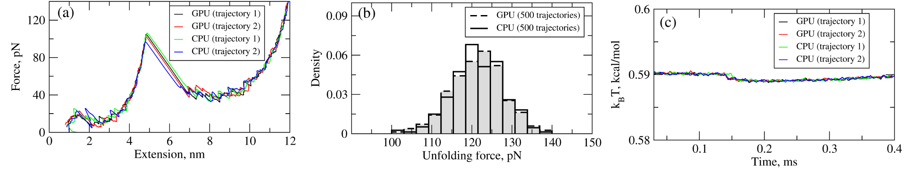
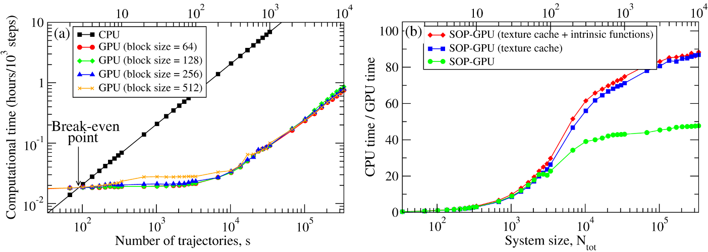
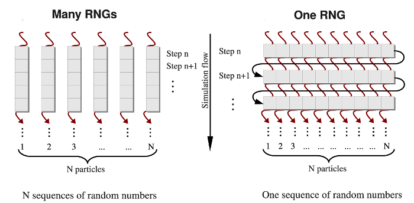
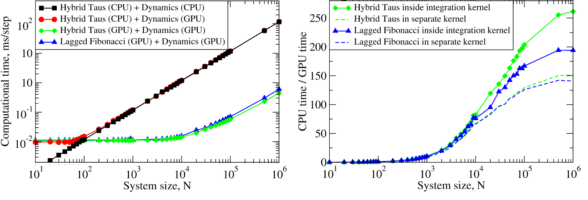
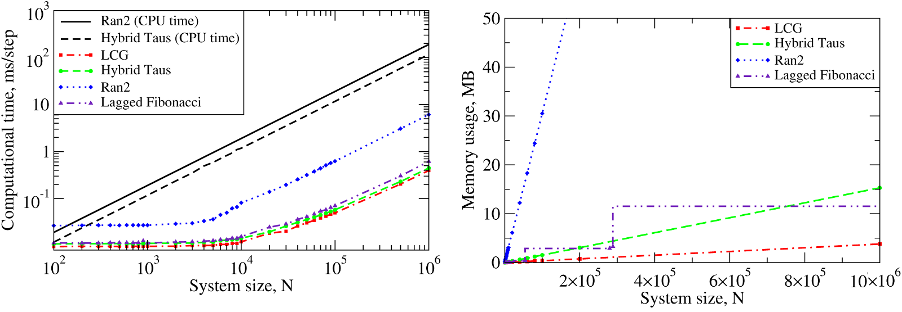

.. role:: todo

.. _theor-sop:

General notes on SOP model
==========================

Method
------

In the topology-based Self-Organized Polymer (SOP) model, each amino acid residue is represented either by a single interaction center described by the corresponding :math:`C_\alpha`-atom, or two interaction centers described by the corresponding :math:`C_\alpha` and :math:`C_\beta` atoms. The first case makes the protein backbone to be represented by a collection of the :math:`C_\alpha-C_\alpha` covalent bonds only. In the second case, backbone atoms are replaced by :math:`C_\alpha` atom and side-chain atoms are replaced by one :math:`C_\beta`-atom, connected covalently to the :math:`C_\alpha` atom of the same amino acid. All the covalent bonds have distance of :math:`a=3.8` Å (peptide bond length) for both cases. Displayed in Figure 1 is an idealized schematic for the coarse-graining procedure using the one interaction center representation of the chain. The potential energy function of a protein conformation :math:`U_{SOP}`, specified in terms of the coordinates of the :math:`C_\alpha` and :math:`C_\beta`-atoms :math:`\{r_i\} = r_1, r_2,\dots, r_N`, where :math:`N` is the total number of particles in coarse-grained model, is given by [Hyeon2006]_ [Mickler2007]_

.. math:: 
   U_{SOP} = U_{FENE} + U_{NB}^{ATT} + U_{NB}^{REP}
   :label: usop

In Eq. :eq:`usop`, the first term is the finite extensible nonlinear elastic (FENE) potential:

.. math::
   U_{FENE}=-\sum_{covalent}\frac{k R_0}{2}\log \left(1-\frac{(r_{ij}-r_{ij}^0)^2}{R_0^2}\right)
   :label: ufene

where :math:`k=14` N/m is the spring constant, and the tolerance in the change of the covalent bond distance is :math:`R_0=2` Å. The FENE potential describes the backbone chain connectivity (:math:`C_\alpha-C_\alpha`) and side-chain connectivity (:math:`C_\alpha-C_\beta`). The distance between the particles (:math:`C_\alpha-C_\alpha` or :math:`C_\alpha-C_\beta`) :math:`i` and :math:`j`, is :math:`r_{ij}`, and :math:`r^0_{ij}` is its value in the native  structure. The summation is performed over all the covalent bonds in the system. To account for the non-covalent (non-bonded) interactions that stabilize the native state, the Lennard-Jones potential is used:

.. math::
   U_{NB}^{ATT} = \sum_{native}\varepsilon_h\left[ \left( \frac{r_{ij}^0}{r_{ij}} \right)^{12} - 2\left( \frac{r_{ij}^0}{r_{ij}} \right)^{6} \right]\Delta_{ij}
   :label: uatt

In Eq. :eq:`uatt`, it's assumed that if the non-covalently linked particles :math:`i` and :math:`j` (:math:`|i-j|>2`) are within the cut-off distance :math:`R_C` in the native state, then :math:`\Delta_{ij}=1`; :math:`\Delta_{ij}=0` otherwise. The distance :math:`R_C=8.0` Å for :math:`C_\alpha-C_\alpha` bonds, :math:`R_C=` :todo:`Artem` Å :math:`C_\alpha-C_\beta` bonds and :math:`R_C=` :todo:`Artem` Å :math:`C_\beta-C_\beta` bonds}. The value of :math:`\varepsilon_h` quantifies the strength of the non-bonded interactions. The non-native (non-bonded) interactions are treated as repulsive:

.. math::
   U_{NB}^{REP} = \sum_{repulsive}^{N-2}\varepsilon_l \left(\frac{\sigma_l}{r_{ij}} \right)^6 + \sum_{repulsive}\varepsilon_l \left( \frac{\sigma_l}{r_{ij}} \right)^6(1-\Delta_{ij})
   :label: urep

In Eq. :eq:`urep`, a constraint is imposed on the bond angle between the particles :math:`i`, :math:`i+1`, and :math:`i+2` by including the repulsive potential with parameters :math:`\varepsilon_l=1` kcal/mol and :math:`\sigma_l=3.8` A. These define the strength and the range of the repulsion. In the SOP model, parameter :math:`\varepsilon_h` sets the energy scale. This parameter can be estimated based on the results of all-atom MD simulations.

The dynamics of the system is obtained by solving numerically the Langevin equations of motion for each particle position :math:`r_i` in the over-damped limit:

.. math::
   \xi \frac{dr_i}{dt} = - \frac{\partial U_i(r_i)}{\partial r_i} + g_i(t)
   :label: ld

In Eq. :eq:`ld`, :math:`U_i(r_i)` is the total potential energy, which accounts for all the biomolecular interactions between the particles in the molecule (:math:`U_{SOP}`; see Eq. :eq:`usop`). It also includes interactions of particles with the indenting object (:math:`U_{tip}`; see Eq. :eq:`utip`) and surface particles in indentation regime (see Section :ref:`theor-indent` below) and external force :math:`f\Delta X` in pulling regime. Also, in Eq. :eq:`ld` :math:`G_i(t)` is the Gaussian distributed zero-average random force, and :math:`\xi` is the friction coefficient [Zhmurov2010]_ [Kononova2013a]_ .

.. figure:: sop.png
   :align: center
   :figwidth: 50%

   **Figure 1:** Coarse-graining procedure for constructing a Self Organized Polymer (SOP) model of a polypeptide chain. Panel **A** exemplifies coarse-graining of the atomic structure of the :math:`\alpha\beta`-tubulin dimer -- the structural unit of the microtubule cylinder. The amino acid residues are replaced by single interaction centers (spherical beads) with the coordinates of the :math:`C_\alpha`-atoms (represented by the black circles). Four representative circles are shown to exemplify the coarse-graining process. Consequently, the protein backbone is replaced by a collection of the :math:`C_\alpha-C_\alpha` covalent bonds with the bond distance of :math:`3.8` Å.  Panel **B** depicts the results of coarse-graining of a small fragment of microtubule cylinder. Four identical copies of the tubulin dimer structure, coarse-grained as described in panel **A**, form a :math:`C_\alpha`-based model of the fragment.

Benchmark simulations
---------------------

We have tested the performance of the SOP-GPU package (written in CUDA - a dialect of C and C++ programming languages) on a NVIDIA GPU Tesla C1060 (MIPT), and have compared the results against the performance of the optimized C code (SOP program) on a dual Quad Core Xeon 2.83 GHz of a similar level of technology. We have analyzed the results of CPU- and GPU-based computations by comparing the force spectra, i.e. :math:`f` versus :math:`X` force-extension profiles, the distributions of unfolding forces (peak forces in the force spectra), and the average temperature :math:`\langle T\rangle`, for the all-:math:`\beta` sheet WW-domain. Aside from small deviations due to the different initial conditions, the profiles of :math:`f(X)` and :math:`\langle T\rangle`, and the unfolding force histograms, obtained on the CPU and on the GPU, agree very well (Figure 2).

   **Figure 2:** Comparison of the results of pulling simulations for the WW-domain obtained on a GPU and on a CPU (pulling speed :math:`\nu_f=2.5 \mu m/s`). Panel (a): Representative examples of the force spectrum (force-extension curves). Panel (b): The histograms of unfolding forces. Panel (c): The average temperature of the system as a function of time :math:`\langle T(t)\rangle`.

We have compared the overall performance of an end-to-end application of the SOP-GPU program with the heavily tuned CPU-based implementation (SOP program) in describing the Langevin dynamics of the WW domain at equilibrium. We profiled the computational performance of the SOP-GPU program as a function of the number of independent trajectories :math:`s` running concurrently on the GPU (**many-runs-per-GPU approach**). While the single CPU core generates one trajectory at a time, the GPU device is capable of running many trajectories at the same time. The results (see Figure 3a) show that, for the WW domain (:math:`N=34`), the GPU accelerates computations starting from 3 independent runs, which is equivalent to a single run for a system of :math:`N \approx 10^2` residues (**one-run-per-GPU approach**). This is the so-called break-even point. While the simulation time on the CPU scales linearly with :math:`s` (or with :math:`N`), the scaling on the GPU in this regime is sublinear (nearly constant) up to :math:`N \approx 10^4` (:math:`s \approx 300` for the WW domain). At this point, the GPU shows significant performance gains relative to the CPU reaching the maximum 80-90-fold speedup (see Figure 3b). The amount of GPU on-board memory, i.e. ~4 GB (Tesla C1060), is sufficient to describe long Langevin dynamics for large biomolecular systems of :math:`\sim 10^4` residues.

   **Figure 3:**  Panel (a): The log-log plot of the computational time per 1,000 steps of the simulations on a CPU and on a GPU versus the system size, :math:`N` (**one-run-per-GPU approach**), and versus the number of independent trajectories running concurrently on a GPU :math:`s` (**many-runs-per-GPU approach**), for the all-:math:`\beta`-strand WW domain. The GPU performance is tested for the thread blocks of size B = 64, 128, 256, and 512. Panel (b): The log-linear plot of the relative CPU/GPU performance (computational speedup) as a function of :math:`N` and :math:`s`. The performance is compared for the SOP-GPU program, and when it is accelerated by using texture cache, and texture cache plus intrinsic mathematical functions.

.. _rng:

Generation of pseudo-random numbers on graphics processors
==========================================================

Pseudo-random number generators are used in many computer applications such as simulations of stochastic systems, numerical analysis, probabilistic algorithms, etc. Numerical modeling of biological systems and processes, e.g., all-atom MD simulations in implicit solvent [Brooks1983]_, [Haberthur2008]_, Langevin simulations [Zhmurov2010b]_, and Monte Carlo simulations [Press1992]_, all require generation of a large number of independent random variables at each step of a simulation run. We developed two approaches for implementation of random number generators (RNGs) on a graphics processing unit (GPU). In the **one-RNG-per-thread approach**, one RNG produces a stream of random numbers in each thread of execution, whereas the **one-RNG-for-all-threads** method builds on the ability of different threads to communicate, thus, sharing random seeds across an entire GPU device. An RNG produces a sequence of random numbers, :math:`u_i`, which is supposed to imitate independent and uniformly distributed random variates from the unit interval :math:`(0,1)`. There are three main requirements for a numerical implementation of an RNG: (1) good statistical properties, (2) high computational speed, and (3) low memory usage. Because a deterministic sequence of random numbers comes eventually to a starting point, :math:`u_{n+p}=u_n`, an RNG should also have a long period :math:`p` [LEcuyer2007]_. In addition, an RNG must pass rigorous statistical tests of randomness (i.e., for independence and for uniformity), and some application-based tests of randomness that offer exact solutions to the test applications [LEcuyer2007]_, [Marsaglia1996]_, [Mascagni2000]_, [Soto1999]. Indeed, using random numbers of poor statistical quality might result in insufficient sampling, unphysical correlations, and even unrealistic results, which might lead to errors in practical applications. We developed the GPU-based realizations of several RNGs, which provide pseudo-random numbers of high statistical quality, using the cycle division paradigm [Zhmurov2011b]_. 

.. _rng-method:

Method
------

Different methods are used to generate the Gaussian distributed random variates :math:`g_i` from the uniformly distributed random numbers :math:`u_i,  (i=1,2,...,n)` [Tsang2000]_, [Marsaglia1964]_, [Box1958]_. Here, we adopt the most commonly used `Box-Mueller transformation <http://en.wikipedia.org/wiki/Box%E2%80%93Muller_transform>`_  [Box1958]_. In the one-RNG-per-thread approach, the basic idea is to partition a single sequence of random numbers among many computational threads running concurrently across an entire GPU device, each producing a stream of random numbers. Since most RNG algorithms, including LCG, Ran2, and Hybrid Taus, are based on sequential transformations of the current state [Press1994]_, then the most common way of partitioning the sequence is to provide each thread with different seeds while also separating the threads along the sequence so as to avoid possible inter-stream correlations (see Figure 4, left panel). On the other hand, several generators, including the `Mersenne Twister <http://en.wikipedia.org/wiki/Mersenne_Twister>`_ and `Lagged Fibonacci <http://en.wikipedia.org/wiki/Lagged_Fibonacci_generator>`_ algorithms, which employ recursive transformations, allow one to leap ahead in a sequence of random variates and to produce the :math:`(n+1)`-st random number without knowing the previous, :math:`n`-th number [Mascagni2004]_. The leap size, which, in general, depends on a choice of parameters for an RNG, can be properly adjusted to the number of threads (number of particles :math:`N`), or multiples of :math:`N` :math:`(M \times N)`. Then, all :math:`N` random numbers can be obtained simultaneously, i.e. the :math:`j`-th thread produces numbers :math:`j, j+N, j+2N,...,` etc. :math:`(j=1,2,...,n)`. At the end of each simulation step, threads of execition must be syncronized to update the current RNG state. Hence, the same RNG state can be shared by all threads, each updating just one elements of the state. We refer to this as the one-RNG-for-all-threads approach (Figure 4, right panel).

   **Figure 4:** A simplified schematic of the one-RNG-per-thread approach (*left panel*) and the one-RNG-for-all-threads approach (*right panel*). In the one-RNG-per-thread approach, one RNG produces a stream of pseudo-random numbers in each :math:`j`-th thread of execution :math:`(j=1,2,...,n)`, i.e., the same RNG algorithm (realized in many RNGs) is running in each thread generating different subsequences of the same sequence of random numbers. The one-RNG-for-all-threads approach builds on the ability of different threads to communicate, and, hence, to share the state of just one RNG across an entire GPU device.

We employed these methods to develop GPU-based implementations of the Linear Congruent Generator (LCG) [Press1992]_, and the Ran2 [Press1992]_, Hybrid Taus [Press1992]_, [Tausworthe1965]_, and additive Lagged Fibonacci algoritms [Press1992]_, [[Mascagni2004]_. These generators have been incorporated into the program for Langevin simulations of biomolecules fully implemented on the GPU. 

.. _rng-bench:

Benchmark simulations
---------------------

We tested RNGs implemented on a GPU in Langevin simulations of :math:`N` Brownian oscillators using the Hybrid Taus and additive Lagged Fibonacci algorithms. We compared the computational time as a function of the system size :math:`N` for three different implementations of Langevin simulations:

- random numbers and Langevin Dynamics are generated on a CPU;
- random numbers, obtained on the CPU, are transfered to the GPU and used to generate Langevin Dynamics on the GPU;
- random numbers and Langevin Dynamics are generated on the GPU.

The results obtained for the 2.83 GHz Intel Core i7 930 CPU, for the 1.15GHz Tesla C2050 (MIPT) show that starting from :math:`\approx10^2` particles, it becomes computationally expensive to generate random numbers on the CPU and transfer them to the GPU in order to generate stochastic trajectories on the GPU (Figure 3, left panel). We observed a ~10−250-fold speedup for Langevin simulations of :math:`N=10^3-10^6` Brownian particles on the GPU (Figure 5, right panel).

   **Figure 5:** *Left panel:* The computational time for Langevin Dynamics (LD) of :math:`N` Brownian oscillators with the Hybrid Taus and additive Lagged Fibonacci RNGs. Considered are three implementations, where random numbers and LD are generated on the CPU (Hybrid Taus (CPU) + Dynamics (CPU)), random numbers are obtained on the CPU, transfered to the GPU and used to propagate LD on the GPU (Hybrid Taus (CPU) + Dynamics (GPU)), and random numbers and LD are generated on the GPU (Hybrid Taus (GPU) + Dynamics (GPU) and Lagged Fibonacci (GPU) + Dynamics (GPU)). *Right panel:* The computational speedup (CPU time/GPU time) for LD simulations fully implemented on the GPU and on the single CPU core. Compared are two options when an RNG (Hybrid Taus or Lagged Fibonacci) is organized in a separate kernel or is inside the main (integration) kernel. 

We also benchmarked the computational efficiency of the GPU-based realizations of the Ran2, Hybrid Taus, and Lagged Fibonacci algorithms using Langevin simulations of :math:`N` Brownian oscillators in three dimensions. For each system size :math:`N`, we ran one trajectory for :math:`10^6` simulation steps. All :math:`N` threads were synchronized at the end of each step to emulate an LD simulation run of a biomolecule on a GPU. The associated execution time and memory usage are profiled in Figure 6 below.

   **Figure 6:** The computational performance of LCG, and the Ran2, Hybrid Taus, and Lagged Fibonacci algorithms in Langevin simulations of :math:`N` Brownian oscillators on the GPU device. *Left panel:* The execution time (CPU time for Langevin simulations with Ran2 and Hybrid Taus RNGs is shown for comparison). *Right panel:* The memory demand, i.e. the amount of memory needed for an RNG to store its current state. Step-wise increases in the memory usage for Lagged Fibonacci are due to the change of constant parameters for this RNG.

On a GPU Ran2 is the most demanding generator as compared to the Hybrid Taus, and Lagged Fibonacci RNGs (Figure 6, left panel). Using Ran2 in Langevin simulations to obtain a single trajectory over :math:`10^9` steps for a system of :math:`N=10^4` particles requires additional ~264 hours of wall-clock time. The associated memory demand for Ran2 RNG is quite high, i.e. >250MB for :math:`N=10^6` (Figure 6, right panel). Because in biomolecular simulations a large memory area is needed to store parameters of the force field, Verlet lists, interparticle distances, etc., the high memory demand might prevent one from using Ran2 in the simulations of a large system. Also, implementing the Ran2 RNG in Langevin simulations on the GPU does not lead to a substantial speedup (Figure 6, left panel). By contrast, the Hybrid Taus and Lagged Fibonacci RNGs are both light and fast in terms of the memory usage and the execution time (Figure 6). These generators require a small amount of memory, i.e. <15-20MB, even for a large system of as many as :math:`N=10^6` particles.

.. _use-sop:

Using SOP-GPU program
=====================

Running SOP-GPU program requires specification of a configuration file (regular text file), containing information about the system of interest and parameters of the simulation::

  sop-gpu config_file.conf

All the information about the simulation protocol and current process is printed out in terminal screen as well as in separate files specified in configuration file. 

There are six regimes of simulation available in SOP-GPU package: minimization simulation, equilibrium simulation, point-/plane-pulling simulation, force indentation and heating simulation. Also, SOP-GPU package has implemented hydrodynamic interactions, which can by optionally included in calculation. Parameters and output files for each of these regimes are described in sections below. 

.. _gen-out:

General output
--------------

The general output files for any regime of simulation are following:

- Energy output file (usual format *.dat*).
- Trajectory coordinates file (format *.dcd*).
- Restart coordinates file (format *.pdb*).
- Reference coordinates file (first frame of the trajectory, format *.pdb*).
- Final coordinates file (format *.pdb*).

The columns of standard energy output file are:

1. Current simulation step.
2. Average Maxwell-Boltzmann temperature (:math:`T`, in kcal/mol).
3. Potential energy of covalent bonds (:math:`U_{FENE}`, in kcal/mol).
4. Potential energy of native interactions (:math:`U_{NB}^{ATT}`, in kcal/mol).
5. Potential energy of repulsive (long range) interactions (:math:`U_{NB}^{REP}`, in kcal/mol).
6. Number of native contacts not ruptured (:math:`Q`).
7. Total potential energy (:math:`U_{SOP}`, in kcal/mol).
8. Gyration radius (:math:`R_{gyr}`, optional).
9. Deviation of hydrodynamic tensor from diagonal form (:math:`\epsilon` (see Eq. :eq:`tea-beta-prime`, optional).

.. _theor-hd:

Hydrodynamic interactions
-------------------------

In Langevin Dynamics simulations in the overdamped limit, equations of motion for particles of the system are propagated forward in time (see Eq. :eq:`ld` and Eq. :eq:`drnum` below) with the amplitude of random force :math:`\rho=\sqrt{2k_BT\zeta/h}=k_BT \sqrt{2/D_{\alpha\alpha}h}`, where :math:`\alpha` runs over all degrees of freedom. In this approach, which ignores the hydrodynamic coupling of degrees of freedom, all particles are described by the same diffusion coefficient :math:`D=D_{\alpha\alpha}=k_BT/\zeta`. 

To account for solvent-mediated many-body effects, one can use an approach proposed originally by Ermak and McCammon [Ermak1978]_ . In this approach, the equation of motion :eq:`drnum` is transformed (in absence of external flow) into the following equation:

.. math::
   \Delta r_\alpha = \sum_{\beta=1}^{3N} {\frac{D_{\alpha\beta}}{kT} F_\beta h} + \sqrt{2h} \sum_{\beta=1}^{3N} {B_{\alpha\beta} g_\beta}
   :label: ermak-dr

The first term on the right-hand side is a hydrodynamic tensor :math:`\mathbf{D}` --- a real :math:`3N\times3N` matrix, in which an entry :math:`D_{\alpha\beta}` is a contribution to the diffusion of :math:`\alpha`-th degree of freedom from the :math:`\beta`-th degree of freedom. Alternatively, tensor :math:`\mathbf{D}` can be represented by an :math:`N\times N` matrix of :math:`3\times 3` submatrices :math:`\mathbf{D}_{ij}`, each corresponding to a pair of particles :math:`i` and :math:`j`. Also, for the correct distribution of random forces, in the second term in equation :eq:`ermak-dr` a real :math:`3N\times3N` matrix :math:`\mathbf{B}` must satisfy the condition :math:`\mathbf{B}^\intercal \mathbf{B}=\mathbf{D}`, where the superscript :math:`{}^\intercal` represents the transpose of a matrix. It is easy to show that when in equation :eq:`ermak-dr` :math:`\mathbf{D}` is a diagonal matrix with the identical matrix elements :math:`D_{\alpha\alpha}=kT/\zeta`, we recover equation :eq:`ermak-dr`. 

In SOP-GPU program, we use the Rotne-Prager-Yamakawa (RPY) form of the hydrodynamic tensor :math:`\mathbf{D}` [Rotne1969]_ [Yamakawa1970]_, which is a positive-definite quantity. The submatrices :math:`\mathbf{D}_{ij}` of RPY tensor are given by the following expressions: 

.. math::
   \mathbf{D}_{ij} = \frac{kT}{\zeta}
   \begin{cases}
    \mathbf{I} 
     & \text{, if } i=j\text{,} \\
     \left( 1 - \frac{9\left|\mathbf{r}_{ij}\right|}{32 a} \right) \mathbf{I} + 
     \left( \frac {3\left|\mathbf{r}_{ij}\right|}{32a} \right) \mathbf{\hat{r}}_{ij} \times \mathbf{\hat{r}}_{ij}
    & \text{, if } i \neq j \text{ and } \left|\mathbf{r}_{ij}\right| < 2a_{HD}\text{,} \\
     \left( 1 + \frac{2a^2}{3\left|\mathbf{r}_{ij}\right|^2} \right) \mathbf{I} + 
     \left( 1 - \frac{2a^2}{\left|\mathbf{r}_{ij}\right|^2} \right) \mathbf{\hat{r}}_{ij} \times 
    \mathbf{\hat{r}}_{ij}
    & \text{, if } i \neq j \text{ and } \left|\mathbf{r}_{ij}\right| \ge 2a_{HD }\text{.}
    \end{cases}
   :label: rpy

In equation :eq:`rpy`, :math:`\mathbf{I}` is the identity matrix of rank 3, :math:`a_{HD}` is the hydrodynamic radius of the particle (we assume that :math:`a_{HD}` is same for all particles, the denotation ":math:`\times`" is used to define the tensor product. 

In SOP-GPU program, we utilized an exact approach of computing :math:`\mathbf{B}` using Cholesky decomposition of :math:`\mathbf{D}`, as well as fast Truncated Expansion approximation (TEA) approach [Geyer2009]_. In the TEA-based approach, the matrix elements of :math:`\mathbf{B}` can be rewritten as :math:`B_{\alpha\beta}=C_\alpha b_{\alpha\beta} D_{\alpha\beta}`, and equation :eq:`ermak-dr` can be recast as

.. math::
   \Delta r_\alpha = \frac{h}{\zeta}
    \sum_{\beta=1}^{3N} \frac{D_{\alpha\beta}}{D_{\alpha\alpha}} \left( F_\beta + C_\alpha b_{\alpha\beta} 
   \cdot \rho g_\beta \right) 
   \text{,}
   :label: tea-dr

where

.. math::
   b_{\alpha\beta} = 
    \begin{cases}
     1       & \text{ if } \alpha = \beta, \\
     b'  & \text{ if } \alpha \neq \beta.
    \end{cases}
   :label: tea-beta

In Eqs. :eq:`tea-dr` and :eq:`tea-beta`, :math:`C_\alpha` and :math:`b'` are given by

.. math::
   C_\alpha = \left( 1 + \sum_{\beta \neq \alpha} 
   {b'^2 \frac{D_{\alpha\beta}}{D_{\alpha\alpha}D_{\beta\beta}}} \right)^{\frac{1}{2}}
   \text{,}
   :label: tea-ci

.. math::
   b' = \frac{1-\sqrt{1-[(N-1)\epsilon^2-(N-2)\epsilon]}}{\sqrt{(N-1)\epsilon^2-(N-2)\epsilon}},
   :label: tea-beta-prime

where :math:`\epsilon=\langle D_{\alpha\beta}/D_{\alpha\alpha}\rangle`. This linearization procedure allows us to efficiently parallelize the integration algorithm on a GPU. 

Cholesky algorithm is implemented by-the-book, i.e. straightforward computation of lower-left-triangular matrix :math:`B` is carried out with :math:`O(N^3)` complexity. Due to implementation design, the single trajectory can not contain more than 128 particles is Cholesky factorization is applied.

There is no agreement regarding the value of the hydrodynamic radius :math:`a_{HD}`. The proposed values vary between :math:`a_{HD}=1.5-5.3` Å [Cieplak2009]_ [Frembgen-Kesner2009]_. However, one must keep in mind that, although the TEA handles overlaps correctly, the RPY tensor is better suited for description of non-overlapping beads. Since the inter-bead :math:`C_{\alpha}-C_{\alpha}`-distance in a polypeptide chain is about :math:`3.8` Å, which corresponds to the length of a peptide bond, :math:`a_{HD}` should not exceed :math:`1.9` Å. 

For hydrodynamic interactions parameters see Section :ref:`par-hd`.

.. _theor-pull:

Pulling simulations
-------------------

Pulling simulations were designed to mimic force-ramp and force-clamp AFM experiments. In this regime, cantilever base is represented by the virtual particle, connected by a harmonic spring to a specified ("pulled") amino acid, mimicking adsorption of residues on the cantilever tip. The system particles specified as "fixed" will be firmly constrained mimicking molecule absorption on the surface. The cantilever base moving with constant velocity (:math:`\nu_f`) extends the cantilever spring, translating into the molecule extension, with the time-dependent force (force-ramp) :math:`{\bf f}(t)=f(t){\bf n}` in the pulling direction :math:`{\bf n}`. The force magnitude, :math:`f(t)=r_f t`, applied to cantilever tip, i.e. to the pulled end of the molecule, increases linearly in time :math:`t` with the force-loading rate :math:`r_f=\kappa \nu_f` [Zhmurov2011]_. 

For pulling simulation parameters see Section :ref:`par-pull`. When pulling is enabled, program will save additional output file (usual format *.dat*) with pulling data. This file has following columns:

1. Current simulation step.
2. Absolute value of the end-to-end distance (:math:`X`, in Å).
3. Projection of the end-to-end distance on pulling vector (:math:`X_{proj}`, in Å).
4. Absolute value of the cantilever spring force (:math:`\kappa \Delta x`, in kcal/molÅ).
5. Force vector component (:math:`F_x`, in kcal/molÅ).
6. Force vector component (:math:`F_y`, in kcal/molÅ).
7. Force vector component (:math:`F_z`, in kcal/molÅ).

.. _theor-ppull:

Plane-pulling simulations
-------------------------

.. _theor-indent:

Force indentation simulations
-----------------------------

Nanoindentation regime adds to the system a cantilever and surface models. In this regime, the cantilever base is represented by the virtual particle, connected to the spherical bead of radius :math:`R_{tip}`, mimicking the cantilever tip (indentor), by a harmonic spring. The tip interacts with the particles via the Lennard-Jones potential

.. math::
   U_{tip} = \sum_{i=1}^{N}{\varepsilon_{tip} \left [A_{tip}\left( \frac{\sigma_{tip}}{|r_i - r_{tip}| - R_{tip}} \right)^{12} + B_{tip} \left( \frac{\sigma_{tip}}{|r_i - r_{tip}| - R_{tip}} \right)^6 \right ]}
   :label: utip

thereby producing an indentation on the particle's outer surface. In Eq. :eq:`utip`, :math:`r_i` and :math:`r_{tip}` are coordinates of the :math:`i`-th particle and the center of the tip, respectively, :math:`\varepsilon_{tip}` and :math:`\sigma_{tip}` are the parameters of interaction, and the summation is performed over all the particles under the tip. The factors :math:`A_{tip}` and :math:`B_{tip}` define the attractive and repulsive contributions into the indentor-particle interactions, respectively. For the standard Lennard-Jones potential :math:`A_{tip}=1` and :math:`B_{tip}=-2`. If :math:`A_{tip}=0` and :math:`B_{tip}=1` the interactions are repulsive only. For the cantilever tip, we solve numerically the following Langevin equation of motion:

.. math::
   \xi_{tip} \frac{dr_{tip}}{dt} = - \frac{\partial U_{tip}(r_{tip})}{\partial r_{tip}} + \kappa((r_{tip}^0 - \nu_f t) - r_{tip})
   :label: ldtip

where :math:`r_{tip}^0` is the initial position of spherical tip center (:math:`\nu_f`  is the cantilever base velocity; :math:`\kappa` is the cantilever spring constant), and :math:`\xi_{tip}` is the friction coefficient for a spherical particle of radius :math:`R_{tip}` in water. To generate the dynamics of the biological particle of interest tested mechanically, the Eqs. :eq:`usop` --- :eq:`ld` for the particle (see above) and Eqs. :eq:`utip` and :eq:`ldtip` for the indentor (spherical tip) should be solved numerically. 

The substrate surface is also modeled using Lennard-Jones potential with parameters of interactions :math:`\varepsilon_{surf}` and :math:`\sigma_{surf}` and factors :math:`A_{surf}` and :math:`B_{surf}` (see Eq. :eq:`utip`). The surface is represented by a number of particles and interaction potential is calculated between each particle in system and particles on the surface. 

The cantilever base moving with constant velocity (:math:`\nu_f`) exerts (through the tip) the time-dependent force (force-ramp) :math:`{\bf f}(t)=f(t){\bf n}` in the direction :math:`{\bf n}` perpendicular to the particle surface. The force magnitude, :math:`f(t)=r_f t`, exerted on the particle increases linearly in time :math:`t` with the force-loading rate :math:`r_f=\kappa \nu_f` [Kononova2013b]_ [Kononova2014]_ .

For force indentation simulation parameters see Section :ref:`par-indent`. The results of indentation will be saved in additional output file (usual format *.dat*) with the following columns:

1. Current simulation step.
2. Distance traveled by cantilever base (:math:`Z`, in Å).
3. Average molecular force acting on a cantilever tip projected onto chip movement direction (:math:`F_{proj}`, in kcal/molÅ).
4. Average absolute value of a molecular force, acting on a cantilever tip, (:math:`F`, in kcal/molÅ).
5. Absolute value of the cantilever spring force at a given step (:math:`\kappa\Delta x`, in kcal/molÅ).
6. Absolute value of the cantilever spring force average (:math:`\overline{\kappa\Delta x}`, in kcal/molÅ).
7. Molecular force vector component (:math:`F_x`, in kcal/molÅ).
8. Molecular force vector component (:math:`F_y`, in kcal/molÅ).
9. Molecular force vector component (:math:`F_z`, in kcal/molÅ).
10. Current cantilever tip coordinate (:math:`X_x`, in Å).
11. Current cantilever tip coordinate (:math:`X_y`, in Å).
12. Current cantilever tip coordinate (:math:`X_z`, in Å).
13. Current cantilever base coordinates (:math:`Z_x`, in Å).
14. Current cantilever base coordinates (:math:`Z_y`, in Å).
15. Current cantilever base coordinates (:math:`Z_z`, in Å).

.. _theor-heat:

Heating simulations
-------------------

Although coarse-grained models are known to be not very accurate in describing heat-induced unfolding of molecules, SOP-model still can provide good qualitative results. When heating option is on, temperature of the water bath (i.e. strength of random force, see Eq. :eq:`drnum` below) increases gradually during the simulation process. Heating parameters are described in Section :ref:`par-heat`.

.. _units:

Units
=====

For numerical evaluation of the Eq. :eq:`ld` in time, it can be written in form

.. math::
   \xi \frac{r_i^{t+1} - r_i^t}{\Delta t} = F_i^t + G_i^t
   :label: lnum

When divide both sides of Eq. :eq:`lnum` by particle mass :math:`m` and express the change of coordinates :math:`\Delta r_i^t=r_i^{t+1} - r_i^t` arrive to

.. math::
   \Delta r_i^t = \frac{\Delta t}{\xi/m}\frac{1}{m}(F_i^t + G_i^t)

From the equation for harmonic oscillator, :math:`\xi/m=\zeta/\tau_L` is damping coefficient. Here :math:`\zeta` is dimensionless damping ratio and :math:`\tau_L=\sqrt{m a^2/\varepsilon_h}` is characteristic time for underdamped motion of spherical particle of mass :math:`m` and radius :math:`a` with energy scale :math:`\varepsilon_h`. According to Langevin equation, the random force :math:`G_i^t=g_i^t\sqrt{2\zeta k_BT/h}`, where :math:`g_i^t` is random number from the interval :math:`[0,1]`. Hence

.. math::
   \Delta r_i^t = \frac{\Delta t \tau_L}{\zeta m}(F_i^t + g_i^t\sqrt{2\zeta k_BT/h})
   :label: drnum

From the Stokes-Einstein friction theory :math:`\xi=6 \pi \eta a` for a spherical particle of radius :math:`a` in a liquid with viscosity :math:`\eta`. Therefore :math:`\zeta = 6 \pi \eta a^2/\sqrt{m \varepsilon_h}`. In the program :math:`\zeta=50`. This was obtained for :math:`a \sim 5` Å, :math:`m \sim 3\times10^{-22}` g (mass of a residue) and the bulk water viscosity :math:`\eta=0.01` gs :math:`^{-1}` cm :math:`^{-1}`. 

In general, :math:`a` varies between :math:`3.8` Å to :math:`5` Å, while :math:`m` varies between :math:`3\times10^{-22}` g to :math:`5\times10^{-22}` g. In the simulations :math:`a=3.8` Å. Because of the fact that :math:`\zeta` depends on :math:`\varepsilon_h`, every time when :math:`\varepsilon_h` was changed, valid :math:`m` value should be calculated, which gives the value :math:`\zeta=50`. 

Example: for :math:`\varepsilon_h=1` kcal/mol from the above equation for :math:`\zeta` we find that :math:`m=4.3\times10^{-22}` g which is a valid value. For :math:`\varepsilon_h=1.5` kcal/mol, we get :math:`m=3\times10^{-22}` g which is still a valid value. After finding the mass :math:`m`, we can go back to the expression for :math:`\tau_L` and get its value. For example, for :math:`\varepsilon_h=1` kcal/mol we get :math:`\tau_L=3` ps while for :math:`\varepsilon_h=1.5` kcal/mol, we get :math:`\tau_L=` ps. 

For the overdamped Langevin dynamics the characteristic time is :math:`\tau_H=\zeta\varepsilon_h\tau_L/kT=6\pi \eta a^3 / kT`. In order to get it in units of ps, both :math:`\varepsilon_h` and :math:`k_BT` need to be of the same units. Since :math:`\varepsilon_h` is in kcal/mol, :math:`k_BT` should be also in kcal/mol (at :math:`T=300` K :math:`k_BT=0.6` kcal/mol). Therefore the simulation time step :math:`\Delta t=h\cdot\tau_H` is also in units of ps. With the standard parameters (:math:`\eta=0.01` gs :math:`^{-1}` cm :math:`^{-1}`, :math:`T=300` K and :math:`a=3.8` Å), :math:`\tau_H=248` ps. The parameter :math:`h` can be specified in configuration file.

In the pulling/indentation simulation, cantilever velocity is defined as :math:`\nu_f=\Delta x/(n_{av} \cdot h \cdot \tau_H)` where :math:`\Delta x` is  displacement of virtual bead, representing cantilever base, during :math:`n_{av}` steps, it is given in Å. The force is calculated in kcal/(molÅ), to get the force in pN, one need to multiplied by :math:`70`. Therefore, the cantilever spring constant :math:`\kappa` should be also specified in the units of kcal/(mol :math:`Å^{2}`).

.. _theor-top:

Topology
========

.. _par-input:

Input parameters file
=====================

.. _gen_feat:

General features
----------------

Input parameters file contains all the simulation parameters listed as tab or space separated pairs of name and value. Remarks are allowed using ":math:`\#`" character. To simplify creation of multiple configuration/output files, parameters values support macroses. This can be use full in order to avoid overwriting of the output files if multiple trajectories are running in parallel, for example when many-runs-per-GPU approach is used. Any parameter name in the file can be used as macros, additional macroses can be added using same name-value syntax as for regular parameters. To use macros, parameter name included in any other parameter value should be surrounded with ":math:`<`" and ":math:`>`" characters. For example, the following lines:: 

  run 3
  DCDfile <run>.dcd

result in the value for the output file name "*3.dcd*".

.. _par-device:

Device parameters
-----------------

- **device** *<device ID>*
 
 Type: Integer.
 
 Status: Required.
 
 Default value: 0.
 
 Purpose: ID of NVidia card to run simulations on. Use "nvidia-smi" or "deviceQuery" from NVidia SDK to check devices.

- **block_size** *<integer>*
 
 Type: Integer.
 
 Status: Optional.
 
 Default value: 256.
 
 Purpose: Set the number of threads per block. Can be specified for every potential individually, using **block_size_covalent**, **block_size_native**, **block_size_pairs**, **block_size_pairlist** and **block_size_possiblepairs**.

- **max_covalent**: *<integer>*
 
 Type: Integer.
 
 Status: Optional.
 
 Default value: 8.
 
 Purpose: Set the maximum number of pairs per residue for covalent interactions.

- **max_native** *<integer>*

 Type: Integer.

 Status: Optional.

 Default value: 128.

 Purpose: Set the maximum number of pairs per residue for native interactions.

- **max_pairs** *<integer>*

 Type: Integer.

 Status: Optional.

 Default value: 512.

 Purpose: Set the maximum number of pairs per residue for pairs list.

- **max_possiblePairs** *<integer>*

 Type: Integer.

 Status: Optional.

 Default value: 4096.

 Purpose: Set the maximum number of pairs per residue for possible pairs list.

.. _par-struct:

Structure parameters
--------------------

- **name** *<protein name>*

 Type: String.

 Status: Required.

 Purpose: Name, assigned to the structure. Used mostly for files naming.

- **topology** *<filename>*

 Type: Path to the file.

 Format: .top

 Status: Required.

 Purpose: Path to the structure topology file (see Section :ref:`theor-top`).

- **coordinates** *<filename>*

 Type: Path to the file.

 Format: .pdb

 Status: Required.

 Purpose: Path to the structure initial coordinates file.

.. _par-sim:

General simulation parameters
-----------------------------
   
- **numsteps** *<steps count>*

 Type: Long integer.

 Status: Required.

 Purpose: Number of simulation steps.

- **timestep** *<time>*

 Type: Float.

 Units: :math:`\tau_H` (see Section :ref:`units`).

 Status: Required.

 Purpose: Time-scale of one simulation step.

- **seed** *<random seed>*

 Type: Integer.

 Status: Optional.

 Default value: Taken from current date and time.

 Purpose: Initial random seed used for random force. Actual seed is computed by adding **run** or **firstrun** (whichever is defined) to this value.

- **run** *<trajectory number>*

 Type: Integer.

 Status: Optional. 

 Default value: -1

 Purpose: Trajectory number when running only one trajectory per GPU ("one-run-per-GPU approach"). Usually used for files naming. Alternatively, **firstrun** and **runnum** can be used.

- **firstrun** *<first trajectory number>*

 Type: Integer.

 Status: Required if **run** is not specified. 

 Purpose: Number of first trajectory when "using many-runs-per-GPU" approach.

- **runnum** *<number of trajectories*>

 Type: Integer.

 Status: Required if **firstrun** is specified. 

 Purpose: Total amount of trajectories for running in parallel on one GPU when using "many-runs-per-GPU" approach. Trajectories from **firstrun** to **firstrun** + **runnum** will be started. Note, that in this case all output files require "<run>" macros, so that the output data will be saved into different files for different trajectories.

.. _par-ff:

Force-field parameters
----------------------

- **temperature** *<temperature value>*

 Type: Float.

 Units: kcal/mol.

 Status: Optional.

 Default value: 0.6.

 Purpose: Set the temperature to heat bath (random force). Default value 0.6 kcal/mol :math:`\approx` 300 K.

- **zeta** *<:math:`\zeta` value>*

 Type: Float.

 Units: Dimensionless.

 Status: Optional.

 Default value: 50.0.

 Purpose: Friction coefficient for amino acid in viscous environment. For a spherical particle: :math:`\zeta = 6\pi \eta a^2/\sqrt{m\varepsilon_h}`, where :math:`\eta = 0.01` gs :math:`^{-1}` cm :math:`^{-1}` is a bulk water viscosity, :math:`m \sim 3 \times 10^{-22}` g is an average mass of an amino acid residue, :math:`a = 3.8` Å is length of amino acid amide bond, :math:`\varepsilon_h` is an average strength (hydrophobicity) of native interactions, it is taken from topology file and usually between :math:`0.9` and :math:`1.5`.

- **kspring_cov** *<spring constant>*

 Type: Float.

 Units: kcal/molÅ.

 Status: Optional.

 Default value: 20.0.

 Purpose: Spring constant :math:`k` of covalent interactions in FENE potential (Eq. :eq:`ufene`).

- **R_limit** *<tolerance in distance change>*

 Type: Float.

 Units: Å.

 Status: Optional.

 Default value: 2.0.

 Purpose: The tolerance in the change of the covalent bond distance :math:`R_0` parameter in FENE potential (Eq. :eq:`ufene`).

- **a** *<covalent bond length>*

 Type: Float.

 Units: Å.

 Status: Optional.

 Default value: 3.8.

 Purpose: Default distance between :math:`C_\alpha`-atoms in polypeptide chain. Amino acid size parameter :math:`\sigma_l` in repulsive Lennard-Jones potential as an a (Eq. :eq:`urep`).

- **el** *<repulsive energy factor>*

 Type: Float.

 Units: kcal/mol.

 Status: Optional.

 Default value: 1.0.

 Purpose: Energy factor :math:`\varepsilon_l` of repulsive interactions (Eq. :eq:`urep`).

.. _par-pairs:

Pairs lists parameters
----------------------

- **pairs_cutoff** *<pairs cut-off distance value>*

 Type: Float.

 Units: Å.

 Status: Optional.

 Default value: 20 Å.

 Purpose: Cut-off distance for a pair of amino acids from a pair list defining whether repulsive interactions between these particles will be taken into account or not. If distance between two particles is larger then this value, force is not computed.

- **pairlist_cutoff** *<pairs (Verlet) list cut-off distance value>*

 Type: Float.

 Units: Å.

 Status: Optional.

 Default value: 20 Å.

 Purpose: Cut-off distance for a pair of amino acids defining whether this pair will be added to pairs (Verlet) list or not. If the distance between two particles is less then this value, pair is added into pairs (Verlet) list.

- **pairs_threshold** *<possible pairs cut-off distance value>*

 Type: Float.

 Units: Å.

 Status: Optional.

 Default value: 200 Å.

 Purpose: Cut-off distance using to generate the list of possible pairs. This list is generated based on exclusion principle: if a pair of amino acids does not belong to covalent bond or native bond and distance between them is less than the threshold value, then the pair is added into possible pairs list.

- **pairs_freq** *<number of steps>*

 Type: Float.

 Status: Optional.

 Default value: 1000.

 Purpose: Frequency of the pairs (Verlet) list update. 

- **possiblepairs_freq** *<number of steps>*

 Type: Float.

 Status: Optional.

 Default value: 100000.

 Purpose: Frequency of the possible pairs list update. 

.. _par-hd:

Hydrodynamic interactions parameters
------------------------------------
 
- **hi_on** *<on/off>*

 Type: Boolean.

 Status: Optional.

 Default value: off.

 Purpose: Switch on calculation of hydrodynamic interactions (see Section :ref:`theor-hd`). 

- **hi_exact** *<on/off>*

 Type: Boolean.

 Status: Optional.

 Default value: off.

 Purpose: Use Cholesky-based method of the hydrodynamic tensor calculation, which is exact approach (see Section :ref:`theor-hd`). If disabled, TEA approach is used.

- **hi_a** *<hydrodynamic radius value>*

 Type: Float.

 Units: Å.

 Status: Optional.

 Default value: 1.8.

 Purpose: Hydrodynamic radius :math:`a_{HD}` of a particle. 

  
- **hi_epsilon_freq** *<number of steps>*

 Type: Integer.

 Status: Required, if **hi_on** is on and **hi_exact** is off.

 Purpose: Frequency of updating ersatz coefficients for TEA method (:math:`\epsilon` in Eq. :eq:`tea-beta-prime`). Recommended value are in range 1--10.

- **hi_capricious** *<on/off>*

 Type: Boolean.

 Status: Optional.

 Default value: on.

 Purpose: Whether to abort execution on weird values of the hydrodynamic tensor in TEA approach. See also **hi_epsmax**.

- **hi_unlisted** *<on/off>*

 Type: Boolean.

 Status: Optional.

 Default value: on.

 Purpose: Whether to calculate all particle-particle interactions, or use the pairs (Verlet) list. Using pairs list is heavily discouraged. If **hi_exact** is on, this parameter is ignored and all particle-particle interactions are always computed.

- **hi_epsmax** *<accuracy value>*

 Type: Float.

 Status: Optional.

 Default value: 999.0.

 Purpose: Abort simulation if :math:`\epsilon` (see Eq. :eq:`tea-beta-prime`) reaches this value and **hi_capricious** is on; since :math:`\epsilon` will never exceed 1, the default parameter value will never trigger abortion.

.. _par-pull:

Pulling parameters
------------------

- **pulling** *<on/off>*

 Type: Boolean.

 Status: Optional.

 Default value: off.

 Purpose: Switch on the pulling regime with pulling parameters (see Section :ref:`theor-pull`). 

- **k_trans** *<cantilever spring constant>*

 Type: Float.

 Units: kcal/mol :math:`Å^{2}`.

 Status: Optional.

 Default value: 0.05.

 Purpose: The value of cantilever spring constant :math:`\kappa`.

- **fconst** *<pulling force>*

 Type: Float.

 Units: kcal/molÅ.

 Status: Required, if **deltax** is not specified.

 Default value: 0.0.

 Purpose: The value of applied external force, using to run pulling simulations with force-clamp protocol.

- **deltax** *<pulling speed>*

 Type: Float.

 Units: Å.

 Status: Required, if **fconst** is not specified.

 Default value: 0.0.

 Purpose: The value defining the cantilever base velocity in simulations with force-ramp protocol. Position of the cantilever base will be displaced by **deltax** every **pullFreq** steps. Actual pulling speed can be calculated as **deltax**/(**pullFreq** :math:`\cdot` **timestep** ) (see Section :ref:`units`).

- **pullFreq** *<number of steps>*

 Type: Integer.

 Status: Optional.

 Default value: **nav**.

 Purpose: The frequency of cantilever base displacement by **deltax**.

- **pullDirection** *<string>*

 Type: "endToEnd" / "vector"

 Status: Required.

 Default value: endToEnd

 Purpose: Direction in which external force if applied. If "endToEnd", cantilever base will move along end-to-end vector, which is obtained from positions of **fixedEnd** and **pulledEnd** residues. If "vector" is chosen, it also requires specification of **pullVector**.

- **pullVector** *< x, y, z normalized coordinates>*

 Type: Vector.

 Status: Required, if **pullDirection** is "vector".

 Purpose: Direction vector of external force application.

- **fixedEnd**, **pulledEnd** *<residue ID >*

 Type: Integer.

 Status: Required.

 Purpose: The residue IDs, which will be used to calculate end-to-end distance.

- **fixed** *<list of residue IDs>*

 Type: List of integers.

 Status: Required.

 Purpose: List of amino acids, which will be fixed during the pulling simulations. The values should be space-separated, interval of the values can be specified as "*value_1* to *value_N*".

- **pulled** *<list of residue IDs>*

 Type: List of integers.

 Status: Required.

 Purpose: List of amino acids to which external force **fconst** will be applied (force-clamp protocol) or which will be displaced by **deltax** (force-ramp protocol). The values should be space-separated, interval of the values can be specified as "*value_1* to *value_N*".

- **pullOutput** *<filename>*

 Type: Path to the file.

 Status: Optional.

 Default value: "pull.<name>_<author><run>.dat"

 Purpose: Path to output file of pulling simulations (see Section :ref:`theor-pull`).

.. _par-indent:

Force indentation parameters
----------------------------

- **indentation** *<on/off>*

 Type: Boolean.

 Status: Optional.

 Default value: off.

 Purpose: Switch on the force indentation regime with indentation parameters (see Section :ref:`theor-indent`). Virtual particles, corresponding to cantilever tip, cantilever base and substrate surface will be added to the coordinates output files. 

- **indentationChip** *<position vector x, y, z>*

 Type: Vector.

 Units: Å.

 Status: Required.

 Purpose: Initial position of the virtual particle representing cantilever base (i.e. cantilever "chip").

- **indentationTip** *<position vector x, y, z>*

 Type: Vector.

 Units: Å.

 Status: Optional.

 Default value: **indentationChip**.

 Purpose: Initial position of the center of virtual sphere representing cantilever tip.

- **indentationDirection** *<direction vector x, y, z>*

 Type: Vector.

 Status: Required.

 Purpose: Direction of the cantilever base movement.

- **indentationTipR** <*radius value>*

 Type: Float.

 Units: Å.

 Status: Required.

 Purpose: Radius of the virtual sphere representing cantilever tip.

- **indentationTipKs** *<spring constant value>*

 Type: Float.

 Units: kcal/mol :math:`Å^{2}`.

 Status: Required.

 Purpose: Spring constant of the cantilever.

- **indentationDeltaX** *<cantilever base velocity>*

 Type: Float.

 Units: Å.

 Status: Required.

 Purpose: The value define the displacement of the virtual particle, representing cantilever base, every **indentationFreq** steps. Actual cantilever base velocity can be calculated as **indentationDeltaX**/(**indentationFreq** :math:`\cdot` **timestep**) (see Section :ref:`units`).

- **indentationSigma** *<range of LJ interactions>*

 Type: Float.

 Units: Å.

 Status: Optional.

 Default value: 1.0.

 Purpose: Repulsive distance for the Lennard-Jones potential :math:`\sigma_{tip}` (see Eq. :eq:`utip`). Note that potential is shifted to the surface of the cantilever tip sphere.

- **indentationEl** *<energy factor of LJ interactions>*

 Type: Float.

 Units: kcal/mol.

 Status: Optional.

 Default value: 1.0.

 Purpose: Repulsive energy factor :math:`\varepsilon_{tip}` for Lennard-Jones potential (see Eq. :eq:`utip`).

- **indentationShowTipSurf** *<yes/no>*

 Type: Boolean.

 Status: Optional.

 Default value: no.

 Purpose: Define whether the program should save coordinates of the cantilever tip and base as well as all the points representing substrate surface in *.dcd* file together with coordinates of the modeled system during indentation simulation. Useful for representation purposes. Tip will be represented as two particles (particle for the cantilever base and particle for the cantilever tip) with chain identificator "T" in *.pdb* file, surface particles will have chain identificator "M".

- **indentationTipA** / **indentationTipB** *<dimensionless constants>*

 Type: Float.

 Status: Optional.

 Default value: 0 and 1, respectively.

 Purpose: Shape of the Lennard-Jones potential for the cantilever tip :math:`A_{tip}` and :math:`B_{tip}` (see Eq. :eq:`utip`, Section :ref:`theor-indent`).

- **indentationTipSigma** *<range of LJ interactions>*

 Type: Float.

 Units: Å.

 Status: Optional.

 Default value: **indentationSigma**.

 Purpose: Repulsive distance for the cantilever tip Lennard-Jones potential :math:`\sigma_{tip}` (see Eq. :eq:`utip`). Will override **indentationSigma**.

- **indentationTipEl** *<energy factor of LJ interactions>*

 Type: Float.

 Units: kcal/mol.

 Status: Optional.

 Default value: **indentationEl**.

 Purpose: Repulsive energy factor :math:`\varepsilon_{tip}` for the cantilever tip Lennard-Jones potential (see Eq. :eq:`utip`). Will override **indentationEl**.

- **indentationTipZeta** < :math:`\zeta` *value for the cantilever tip>*

 Type: Float.

 Status: Optional.

 Default value: 5000.0.

 Purpose: Friction coefficient for the cantilever tip in viscous environment (see Eq. :eq:`ldtip` and also section :ref:`units`).

- **indentationFixTrans** *<yes/no>*

 Type: Boolean.

 Status: Optional.

 Default value:

 Purpose: Define if movement of the cantilever tip should be constrained for movement just along the indentation direction. All the transversal motions will be suppressed. 

- **indentationCantLength** *<distance>*

 Type: Float.

 Units: Å.

 Status: Optional.

 Default value: 500.0 Å.

 Purpose: Length of the cantilever for its representation. Makes any difference only if **indentationShowTipSurf** is enabled.

- **indentationDiscreteSurf** *<yes/no>*

 Type: Boolean.

 Status: Optional.

 Default value: no.

 Purpose: If enabled, substrate surface will be represented as a set of interacting beads, positioned according to the surface representation (parameters **indentationSurfaceSize** and **indentationSurfaceStep**). Otherwise, potential will be continuous (the function fill be computed using the normal vector).

- **indentationSurfaceR0** *<position vector>*

 Type: Vector.

 Units: Å.

 Status: Required.

 Purpose: Position of the substrate surface surface.

- **indentationSurfaceN** *<direction vector x, y, z>*

 Type: Vector.

 Status: Required.

 Purpose: Substrate surface normal vector.

- **indentationSurfA** / **indentationSurfB** *<dimentionless constants>*

 Type: Float.

 Status: Optional.

 Default value: 0 and 1, respectively.

 Purpose: Shape of the Lennard-Jones potential for the substrate surface :math:`A_{surf}` and :math:`B_{surf}`, same as in Eq. :eq:`utip` for the cantilever tip (see Section :ref:`theor-indent`).

- **indentationSurfSigma** *<range of LJ interactions>*

 Type: Float.

 Units: Å.

 Status: Optional.

 Default value: **indentationSigma**.

 Purpose: Repulsive distance for the surface Lennard-Jones potential :math:`\sigma_{surf}`. Will override **indentationSigma**.

- **indentationSurfEl** *<energy factor of LJ interactions>*

 Type: Float.

 Units: kcal/mol.

 Status: Optional.

 Default value: **indentationEl**.

 Purpose: Repulsive energy factor :math:`\varepsilon_{surf}` for the surface Lennard-Jones potential. Will override **indentationEl**.

- **indentationSurfaceSize** *<number of points>*

 Type: Integer.

 Status: Optional.

 Default value: 51.

 Purpose: Number of points in length to represent square substrate surface. Total number of points saved will be a square value of this.

- **indentationSurfaceSizeX** / **indentationSurfaceSizeY** *<number of points>*

 Type: Integer.

 Status: Optional.

 Default value: 51 and 51.

 Purpose: Number of points in length/width to represent rectangular substrate surface. Total number of points saved will be equal to **indentationSurfaceSizeX** :math:`\times` **indentationSurfaceSizeY**.

- **indentationSurfaceStep** *<distance>*

 Type: Float.

 Units: Å.

 Status: Optional.

 Default value: 10 Å.

 Purpose: Distance between points representing substrate surface.

- **indentationMoveSurface** *<yes/no>*

 Type: Boolean.

 Status: Optional.

 Default value: no.

 Purpose: Define whether the substrate surface will be moving along :todo:`Artem` direction, rather than cantilever.

- **indentationSurfConnectFile** *<filename>*

 Type: Path to the file.

 Format: .vmd

 Status: Optional.

 Default value: connect_mica.vmd.

 Purpose: Filename of a dump "connect" script that can be used in VMD to show the mica as a surface rather than set of points.

- **indentationPairsCutoff** *<distance value>*

 Type: Float.

 Units: Å.

 Status: Optional.

 Default value: 40.0 Å.

 Purpose: Cut-off distance for the pairs list if the surface is represented as a set of discreet beads.

- **indentationOutput** *<filename>*

 Type: Path to the file.

 Format: *.dat*

 Status: Optional.

 Default value: "indentation.<name>_<author><run>.dat".

 Purpose: Filename for indentation output file.

- **indentationOutputFreq** *<number of steps>*

 Type: Integer.

 Status: Optional.

 Default value: 1000.

 Purpose: Frequency of writing output of indentation process in the **indentationOutput** file and on the terminal screen.

- **indentationRetractionStep** *<number of a step>*

 Type: Integer.

 Status: Optional.

 Default value: -1.

 Purpose: If specified, direction of indentation will be reversed on this step.

.. _par-heat:

Heating parameters
------------------

- **heating** *<on/off>*

 Type: Boolean.

 Status: Optional.

 Default value: off.

 Purpose: Switching on the heating regime with heating parameters. 

- **initialT** *<initial temperature>*

 Type: Float.

 Units: kcal/mol.

 Status: Required.

 Purpose: Initial system temperature.

- **deltaT** *<temperature increment>*

 Type: Float.

 Units: kcal/mol.

 Status: Required.

 Purpose: Value of the temperature increment that will be added to the initial temperature every **tempFreq** steps.

- **tempFreq** *<number of steps>*

 Type: Integer.

 Status: Required.

 Purpose: Frequency of updating the temperature.

.. _par-out:
   
Output parameters
-----------------

- **reffilename** *<filename>*

 Type: Path to the file.

 Format: *.pdb*.

 Status: Optional.

 Default value: "<name>.ref.pdb".

 Purpose: Name of the reference output file with the coordinated of modeled system as well as cantilever tip, base and substrate surface if **indentation** is "on". This can be used to load structure into VMD.

- **outputtiming** *<number of steps>*

 Type: Integer.

 Status: Optional.

 Default value: 10000.

 Purpose: Frequency of writing out energy output of simulation process (see Section :ref:`gen-out`}).

- **outputname** *<filename>*

 Type: Path to the file.

 Format: *.dat*.

 Status: Optional.

 Default value: "energy.<name>_<author><run>.dat".

 Purpose: Name of the output file to save resulted energy. If file exists, it will be overwritten.

- **outputcolwidth** *<number of characters>*

 Type: Integer.

 Status: Optional.

 Default value: 16.

 Purpose: Width of one column in output file, specified in amount of characters.

- **printruns** *<number of trajectories>*

 Type: Integer.

 Status: Optional.

 Default value: 10.

 Purpose: Number of trajectories for which output energies will be printed out in terminal screen when many-runs-per-GPU approach is utilized.

- **computeRg** *<yes/no>*

 Type: Boolean.

 Status: Optional.

 Default value: no.

 Purpose: Specified if program should calculate and print in output file radius of gyration of the modeled system.

- **R_limit_bond** *<cut-off distance>*

 Type: Float.

 Units: Å.

 Status: Optional.

 Default value: 8.0 Å.

 Purpose: Cut-off radius to calculate the number of survived native contacts in during simulation.

- **dcdfreq** *<number of steps>*

 Type: Integer.

 Status: Optional.

 Default value: 10000.

 Purpose: Frequency of writing out structure coordinates in .dcd output file in course of simulation. 

- **DCDfile** *<filename>*

 Type: Path to dcd file.

 Status: Optional.

 Default value: "<name>_<author><run>.dcd".

 Purpose: Name of dcd file to write coordinates output in. If file exists, it will be overwritten.

- **restartfreq** *<number of steps>*

 Type: Integer.

 Status: Optional.

 Default value: 100000.

 Purpose: Frequency to save current structure coordinates in *.pdb* file.

- **restartname** *<filename>*

 Type: Path to the file.

 Format: *.pdb*.

 Status: Optional.

 Default value: "<name>_<author><run>_restart".

 Purpose: Extensionless name of the restart files. Only particle coordinates are saved.

- **finalcoord** *<filename>*

 Type: Path to the file.

 Format: *.pdb*.

 Status: Optional.

 Default value: "<name>_<author><run>_final.pdb".

 Purpose: Filename for the final coordinates.

.. [Hyeon2006] \C. Hyeon, R. I. Dima, and D. Thirumalai (2006) "Pathways and kinetic barriers in mechanical unfolding and refolding of RNA and proteins", *Structure* **14** (11): 1633-1645.

.. [Mickler2007] \M. Mickler, R. I. Dima, H. Dietz, C. Hyeon, D. Thirumalai, and M. Rief (2007) "Revealing the bifurcation in the unfolding pathways of GFP using single molecule experiments and simulations",  *Proc. Natl. Acad. Sci. USA* **104** (51): 20268–20273.

.. [Zhmurov2010] \A. Zhmurov, R. I. Dima, and V. Barsegov (2010) "Order statistics theory of unfolding of multimeric proteins", *Biophys. J.* **99**: 1959.

.. [Kononova2013a] \O. Kononova, L. Jones, and V. Barsegov (2013) "Order statistics inference for describing topological coupling and mechanical symmetry breaking in multidomain proteins", *J. Chem. Phys.* **139** (12): 121913.

.. [Ermak1978] \D. Ermak and J. A. McCammon (1978) "Brownian dynamics with hydrodynamic interactions", *J. Chem. Phys.* **69** (4): 1352.

.. [Rotne1969] \J. Rotne and S. Prager (1969) "Variational Treatment of Hydrodynamic Interaction in Polymers", *J. Chem. Phys.* **50** (11): 4831-4837.

.. [Yamakawa1970] \H. Yamakawa (1970) "Transport Properties of Polymer Chains in Dilute Solution: Hydrodynamic Interaction", *J. Chem. Phys.* **53** (1): 436-443.

.. [Geyer2009] \T. Geyer and U. Winter (2009) "An :math:`O(N^2)` approximation for hydrodynamic interactions in Brownian dynamics simulations", *J. Chem. Phys.* **130** : 114905.

.. [Cieplak2009] \M. Cieplak and S. Niewieczerzal (2009) "Hydrodynamic interactions in protein folding", *J. Chem. Phys.* **130** : 124906.

.. [Frembgen-Kesner2009] \T. Frembgen-Kesner and A. H. Elcock (2009) "Striking Effects of Hydrodynamic Interactions on the Simulated Diffusion and Folding of Proteins", *J. Chem. Theory. Comput.* **5** : 242-256.

.. [Zhmurov2011] \A. Zhmurov, A. E. X. Brown, R. I. Litvinov, R. I. Dima, J. W. Weisel, and V. Barsegov (2011) "Mechanism of fibrin(ogen) forced unfolding", *Structure* **19** (11): 1615-1624.

.. [Kononova2013b] \O. Kononova, J. Snijder, M. Brasch, J. Cornelissen, R. I. Dima, K. A. Marx, G. J. L. Wuite, W. H. Roos, and V. Barsegov (2013) "Structural transitions and energy landscape for cowpea chlorotic mottle virus capsid mechanics from nanomanipulation *in vitro* and *in silico*", *Biophys. J.* **105** (8): 1893-1903.

.. [Kononova2014] \O. Kononova, Y. Kholodov, K. E. Theisen, K. A. Marx, R. I. Dima, F. I. Ataullakhanov, E. L. Grishchuk, and V. Barsegov (2014) "Tubulin bond energies and microtubule biomechanics determined from nanoindentation *in silico*", *J. Am. Chem. Soc.* **136** (49): 17036-17045.

.. [Brooks1983] \B. R. Brooks, R. E. Bruccoleri, B. D. Olafson, D. J.  States,  S. Swaminathan and M. Karplus (1983) "CHARMM: A program for macromolecular energy, minimization, and dynamics calculations", *J. Comput. Chem.* **4**: 187-217.

.. [Haberthur2008] \U. Haberthür, A. Caflisch (2008) "FACTS: Fast analytical continuum treatment of solvation", *J. Comput. Chem.* **29**: 701-715.

.. [Zhmurov2010b] \A. Zhmurov, R. I. Dima, Y. Kholodov and V. Barsegov (2010) "SOP-GPU: Accelerating biomolecular simulations in the centisecond timescale using graphics processors", *Proteins* **78**: 2984-2999. 

.. [Press1992] \W. H. Press, S. A. Teukolsky, W. T. Vetterling and B. P. Flannery. "Numerical Recipes in C", 2nd ed. *The Art of Scientific Computing*, Cambridge University Press, 1992.

.. [LEcuyer2007] \P. L'Ecuyer and R. Simard (2007) "TestU01: A C library for empirical testing of random number generators", *ACM T. Math. Software.*  **33**: 22.

.. [Marsaglia1996] \G. Marsaglia (1996) "DIEHARD: A battery of tests of Randomness" (http://stat.fsu.edu/geo/diehard.html).

.. [Mascagni2000] \M. Mascagni and A. Srinivasan (2000) "Algorithm 806: SPRNG: A scalable library for pseudorandom number generation", *ACM T. Math. Software.* **26**: 436-461.

.. [Soto1999] \J. Soto (1999) "Statistical testing of random number generators" (http://csrc.nist.gov/rng/).

.. [Zhmurov2011b] \A. Zhmurov, K. Rybnikov, Y. Kholodov and V. Barsegov (2011) "Generation of random numbers on graphics processors: Forced indentation *in silico* of the bacteriophage *HK97*", *J. Phys. Chem. B* **115**: 5278-5288. 

.. [Tsang2000] \W. W. Tsang and G. Marsaglia (2000) "The Ziggurat Method for Generating Random Variables", *J. Stat. Softw.* **5**.

.. [Marsaglia1964] \G. Marsaglia and T. A. Bray (1964) "A convenient method for generating normal variables", *SIAM Rev.* **6**: 260-264.

.. [Box1958] \G. E. P. Box and M. E. Mueller (1958) "A note on the generation of normal random deviates", *Ann. Math. Stat.* **29**: 610-611.

.. [Mascagni2004] \M. Mascagni and A. Srinivasan (2004) "Parameterizing parallel multiplicative lagged Fibonacci generators", *Parallel Comput.* **30**: 899-916.

.. [Tausworthe1965] \R. C. Tausworthe (1965) "Random numbers generated by linear recurrence modulo two", *Math. Comput.* **19**: 201-209.

